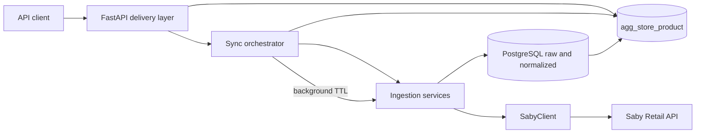
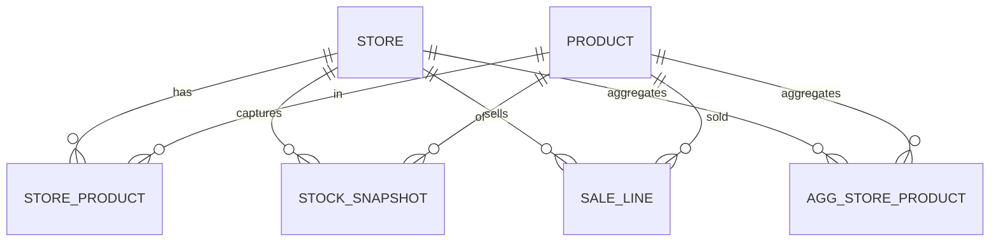

## Контекст и вводные

- Готовый клиент и схемы не трогаем: [SabyClient](src/backend/app/integrations/saby/client.py) и [schemas.py](src/backend/app/integrations/saby/schemas.py) остаются контрактом с внешним API.
- Масштаб: ~10 точек, ~2000 SKU, окно продаж 3–5 мес.
- Стратегия свежести: on-demand — пользовательский запрос триггерит синк, если данные устарели, плюс фоновое обновление после ответа.
- Ограничения: без ML, фокус backend.

Порядок реализации отражён в списке todo.

---

## 1. Слои системы

- **ingestion**: 3 сервиса (`points_sync`, `stock_sync`, `sales_sync`) поверх текущего `SabyClient`. Преобразуют ответ Saby (Pydantic-схемы) в строки БД через upsert. Пагинация и ретраи — внутри сервиса.
- **storage**: одна БД PostgreSQL. Три слоя таблиц: raw (опционально, JSONB для аудита), нормализованные сущности, агрегаты.
- **processing**: orchestrator решает «данные свежие / надо синкать», управляет блокировками (advisory locks), пересчитывает агрегат после ingestion. Живёт в том же процессе FastAPI.
- **delivery**: FastAPI-эндпоинты читают агрегат и нормализованные таблицы. Существующие «прокси»-эндпоинты в [saby.py](src/backend/app/api/v1/endpoints/saby.py) остаются как debug/инспектор Saby, основной трафик идёт через новые ресурсы `/api/v1/overview`, `/api/v1/stores`, `/api/v1/products`.

---

## 2. Модель данных

Нормализация на 3-ю НФ с отдельной агрегатной таблицей. Поля источника — только те, что реально отдаёт Saby в схемах; лишнее складываем в `raw` JSONB.

### Ядро

- **store** (торговая точка)
  - `id` BIGINT PK — равно `PointSchema.id`
  - `name`, `address`, `locality` TEXT
  - `prices` INT[] — из `PointSchema.prices`
  - `raw` JSONB, `first_seen_at`, `updated_at`
- **product** (товар, глобальный справочник по article)
  - `article` TEXT PK — натуральный ключ из `ProductSchema.article` / `ProductBalanceScema.article`
  - `name` TEXT, `unit` TEXT
  - `updated_at`
  - Обоснование: `article` приходит и в продажах, и в остатках, и в номенклатуре — это единственная сквозная связка.
- **store_product** (товары, встречавшиеся в точке; нужен, чтобы выдавать список «ассортимент точки»)
  - `(store_id, article)` PK
  - `last_stock_at`, `last_sale_at`
- **stock_snapshot** (иммутабельный снимок остатков на момент синка)
  - `id` BIGSERIAL PK
  - `store_id`, `article`, `balance` NUMERIC (число, распаршенное из строки `ProductBalanceScema.balance`), `captured_at`
  - UNIQUE `(store_id, article, captured_at)` — защита от дублей в рамках одного синка
- **stock_current** (быстрый доступ к «последнему» остатку, поддерживается триггером или upsert'ом из ingestion)
  - `(sto`  
  `re_id, article)` PK, `balance`, `captured_at`
- **sale_line** (факт продажи товара в точке)
  - `id` BIGSERIAL PK
  - `store_id`, `article`, `sold_at` TIMESTAMPTZ, `qty` NUMERIC (= `ProductSchema.count`), `unit` TEXT
  - `external_order_id` TEXT nullable — если в payload заказа есть id, используем для идемпотентности
  - UNIQUE по бизнес-ключу для идемпотентности (см. ниже)
  - Индексы: `(store_id, sold_at)`, `(article, sold_at)`, BRIN по `sold_at`
- **sync_run** (журнал ingestion)
  - `id`, `entity` ENUM('points','stock','sales'), `store_id` nullable, `started_at`, `finished_at`, `status`, `cursor_from`, `cursor_to`, `rows_upserted`, `error`
- **agg_store_product** (денормализованная витрина для пользователя)
  - `(store_id, article)` PK
  - `store_name`, `product_name`, `unit`
  - `stock_balance`, `stock_captured_at`
  - `sales_qty_30d`, `sales_qty_90d`, `sales_qty_window` (3–5 мес, окно из конфига), `avg_daily_qty`, `last_sale_at`
  - `days_of_cover` = `stock_balance / NULLIF(avg_daily_qty, 0)`
  - `refreshed_at`

### Связи

### Ключевой вопрос: идемпотентность продаж

У Saby `list_sales` — это `/retail/order/list` (заказы). Проблема: если в payload у позиции нет стабильного уникального `line_id`, честный UNIQUE собрать нельзя. Два варианта, финальный выбирается при реализации, когда увидим реальный ответ:

- (A) если есть `order_id` + `line_no` → UNIQUE `(external_order_id, line_no)`.
- (B) если нет — синкать продажи «окнами» и на каждой загрузке заменять все `sale_line` в окне `[from, to)` для `store_id` одной транзакцией (DELETE + INSERT). Это безопасно, потому что Saby — источник истины на окно.

Вариант (B) — дефолтный, безопасен и прост; (A) включаем, если поле найдётся.

---

## 3. Выбор хранилища

- **PostgreSQL 15+** — единственная БД и для нормализованных сущностей, и для агрегатов.
  - Объём: 10 × 2000 = 20k строк в `stock_current`; продажи за 5 мес ~ сотни тысяч строк максимум. Для таких объёмов Postgres избыточно комфортен, партиционирование не нужно.
  - Даёт честные джойны, транзакции для «DELETE+INSERT окна продаж», JSONB для сырья, расширение `pg_trgm` для поиска по названию.
- **ClickHouse — не вводим.** Обосновано масштабом: аналитические запросы по 100k–1M строкам Postgres отдаёт за миллисекунды. ClickHouse имеет смысл от десятков миллионов строк.
- **Redis — не вводим на MVP.** Вместо него:
  - TTL и «свежесть» считаем по `sync_run.finished_at` в самой Postgres.
  - Взаимное исключение параллельных синков одного стора/сущности — через `pg_advisory_xact_lock(hash(entity, store_id))`.
- **SQLAlchemy 2.x + Alembic** для миграций. Async-драйвер (`asyncpg`) — естественно ложится на текущий `async` FastAPI и `httpx.AsyncClient`.

---

## 4. Стратегия обновления данных

Выбранный режим — **on-demand с фоновой подтяжкой и TTL**. Никакого внешнего брокера.

Частоты и TTL (задаются в [core/config.py](src/backend/app/core/config.py)):

- `points`: TTL ~ 24 ч. Точек мало, меняются редко. Полный refresh (truncate + upsert) — это дешёво.
- `stock`: TTL ~ 15 мин. Полный снимок по всем точкам каждый раз (один `list_products(with_balance=True)` на точку или `list_balances` батчем). Пишем в `stock_snapshot` + upsert `stock_current`.
- `sales`: TTL ~ 30 мин. **Инкрементально**: `fromDateTime = last_sale_at - overlap(1 день)`; `toDateTime = now`. Дублирование окна защищает от late-arriving записей, идемпотентность — через стратегию (A) или (B).
- На холодном старте — единичная полная загрузка sales за окно 3–5 мес.

Триггеры синка:

1. **Pull по запросу пользователя** (основной): при GET `/api/v1/overview` оркестратор смотрит `sync_run` — если сущность устарела, ставит фоновую задачу (`BackgroundTasks`) и отдаёт текущие данные из БД с флагом `stale: true`. На следующем запросе пользователь увидит свежие.
2. **Ручной**: POST `/api/v1/sync/{entity}` — форс-рефреш с ожиданием результата (для админа).
3. **Периодический heartbeat (опционально)**: `APScheduler` внутри FastAPI раз в N минут вызывает тот же оркестратор, чтобы данные не «простаивали» по ночам. Никаких отдельных процессов.

Почему не push: у Saby webhook'ов нет, только pull. Поэтому pull + дедупликация.

Почему не Celery: 10 точек, 2000 SKU, on-demand. Полный синк всего укладывается в несколько секунд в одной корутине. Добавлять брокер и воркер — оверхед.

---

## 5. Агрегация

**Предрасчёт в таблицу `agg_store_product`.** Выбрано вместо materialized view и runtime-вычисления потому, что:

- `agg_store_product` обновляется точечно после ingestion конкретной сущности (локально по затронутым `store_id`), а `REFRESH MATERIALIZED VIEW` — всегда целиком.
- runtime-запрос с оконкой и джойнами sales+stock каждый раз — при 10 точках это работает, но «пользовательская таблица» — самый горячий read path; держать её предрасчётом честнее.

Правила пересчёта:

- После `sales_sync(store_id)` → пересчитываем строки агрегата для этого `store_id`.
- После `stock_sync(store_id)` → обновляем только `stock_balance`, `stock_captured_at` и `days_of_cover`.
- После `points_sync` → обновляем `store_name`.
- Пересчёт — один `INSERT ... ON CONFLICT DO UPDATE` из SQL, читающего из `sale_line` и `stock_current`. Вся логика оконных сумм живёт в одном запросе.

Выдача пользователю:

- `GET /api/v1/overview?store_id=…&search=…&stock_gt=0&sort=days_of_cover` — листает `agg_store_product`, дешёвый и единообразный ответ.
- `GET /api/v1/stores/{id}/products` — срез по точке.
- `GET /api/v1/products/{article}` — срез по товару во всех точках (сквозной взгляд).

---

## 6. Производительность

- **Избегаем повторных запросов к API**: TTL на уровне `sync_run`. Пока TTL не истёк, ни один запрос пользователя не вызывает `SabyClient`.
- **Блокировка параллельных синков**: `pg_advisory_xact_lock` по ключу `(entity, store_id)`. Второй конкурентный синк той же сущности мгновенно возвращает «уже идёт».
- **Дедупликация продаж**: стратегия (B) с транзакционным `DELETE ... WHERE store_id=? AND sold_at >= from AND sold_at < to` + `INSERT`, либо `ON CONFLICT` при стратегии (A).
- **Батчинг**: upsert через `INSERT ... VALUES ... ON CONFLICT` пачками по 500–1000 строк, один round-trip.
- **Индексы**: уже перечислены (`sale_line(store_id, sold_at)`, BRIN по `sold_at`, PK по `(store_id, article)` для агрегата).
- **Кэш ответа API** не нужен: `agg_store_product` сам по себе «кэш».

---

## 7. Масштабируемость

Что меняется при росте до 1000+ точек:

- Ingestion становится длиннее → разделяем на per-store задачи и добавляем внешнюю очередь. Минимальный шаг — `ARQ` (redis + async, идиоматично для asyncio) или `Celery`. На этом этапе появляется Redis как брокер, не как кэш.
- `sale_line` начинает расти линейно по точкам × SKU × окно. При десятках миллионов строк — партиционирование по `sold_at` (RANGE) по месяцам, автоматическое отвальное окно удаления старше N месяцев.
- Если понадобится широкая аналитика «все точки × все товары × любые окна» — добавляем ClickHouse как read-replica: DWH-пайп из Postgres (CDC через Debezium/logical replication) либо простой nightly dump. Нормализованные сущности остаются в Postgres.
- Агрегат `agg_store_product` превращается в частичные обновления (только затронутые `store_id`). Логика уже такая — рост безболезнен.
- FastAPI масштабируется горизонтально (читать можно сколько угодно инстансов), ingestion выносится в отдельный воркер-процесс.

Что НЕ меняется: модель данных, контракт API для пользователя, Saby-клиент и его Pydantic-схемы.

---

## 8. MVP

Минимум, который закрывает бизнес-логику «точки + продажи 3–5 мес + остатки + удобный доступ»:

- PostgreSQL + Alembic + SQLAlchemy async.
- Модели: `store`, `product`, `sale_line`, `stock_current`, `sync_run`, `agg_store_product`. Без `stock_snapshot` и без `store_product` — добавим, когда понадобится история остатков и отдельный «ассортимент точки».
- Ingestion-сервисы для `points`, `stock`, `sales` поверх существующего `SabyClient`, без внешнего планировщика. Триггер — pull при запросе + ручной `/sync`.
- Оркестратор: TTL + `pg_advisory_xact_lock` + `BackgroundTasks` FastAPI. APScheduler — опционально.
- Один пользовательский эндпоинт `GET /api/v1/overview` поверх `agg_store_product` плюс срезы по стору/товару.
- Без Redis, без Celery, без ClickHouse, без кэшей в памяти.
- Существующие «сырые» Saby-эндпоинты оставить под префиксом `/api/v1/saby/`* как admin/debug.

Этого достаточно, чтобы закрыть п.1–4 бизнес-логики и быть готовыми к росту без переписывания модели.