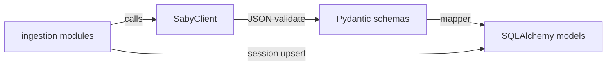

# Структура: запросы к API, DTO и запись в БД

## Принцип разделения

Три ответственности, три места в коде:

| Слой | Роль | Где в проекте |
|------|------|----------------|
| Транспорт + парсинг JSON в DTO | HTTP, токены, пагинация; ответ → Pydantic | [`src/backend/app/integrations/saby/`](src/backend/app/integrations/saby/) |
| Доменная загрузка | DTO → строки БД (upsert), транзакции с оркестратором | [`src/backend/app/ingestion/`](src/backend/app/ingestion/) |
| Точки входа вне процесса API | Разовые команды, cron | [`scripts/`](scripts/) (уже есть [`bootstrap_sync.py`](scripts/bootstrap_sync.py)) |



Сейчас [`client.py`](src/backend/app/integrations/saby/client.py) отдаёт `dict[str, Any]`. Логичный следующий шаг: методы клиента возвращать **уже разобранные DTO** (или обёртки ответа из [`schemas.py`](src/backend/app/integrations/saby/schemas.py)), а сырой dict оставить только внутри `_get` / для отладки.

---

## Рекомендуемая структура каталогов

**1. Интеграция Saby (DTO + клиент)**

```
src/backend/app/integrations/saby/
  __init__.py
  client.py              # SabyClient: только httpx, вызовы эндпоинтов
  schemas/
    __init__.py          # реэкспорт публичных моделей
    common.py            # общие поля / базовые типы при необходимости
    points.py            # PointSchema, SalesPointsResponse, ...
    nomenclature.py      # товары, остатки, balances
    orders.py            # заказы / продажи (если по доке отдельно)
```

- Текущий монолитный [`schemas.py`](src/backend/app/integrations/saby/schemas.py) переносится по мере роста в `schemas/*.py` (или остаётся одним файлом, пока моделей мало).
- **Правило:** в `schemas/` нет импортов из `app.models` и `sqlalchemy`.

**2. Загрузка в БД (не один скрипт — модули по сущностям)**

Уже есть и это остаётся основным местом «заполнения БД»:

```
src/backend/app/ingestion/
  __init__.py
  points.py      # sync_points: client → DTO → store row
  stock.py
  sales.py
  utils.py
```

Опционально при усложнении маппинга:

```
src/backend/app/ingestion/
  mappers/
    __init__.py
    points.py    # PointSchema -> Store ORM dict/объект
    stock.py
    sales.py
```

- **Правило:** `ingestion` импортирует `SabyClient`, DTO из `integrations.saby.schemas`, ORM из `app.models`.

**3. Оркестрация (уже есть)**

- [`src/backend/app/services/orchestrator.py`](src/backend/app/services/orchestrator.py) — TTL, блокировки, вызов `sync_*` и `refresh_aggregate`. Сюда не класть разбор JSON.

**4. Скрипты (тонкий слой)**

- [`scripts/bootstrap_sync.py`](scripts/bootstrap_sync.py) — дергает **уже существующий HTTP API** (`POST /sync/...`), не дублирует бизнес-логику.
- Если понадобится **офлайн/без uvicorn** прогон ingestion: отдельный скрипт `scripts/run_ingestion.py`, который создаёт `AsyncSession`, `SabyClient`, вызывает те же `sync_points` / `sync_stock` / `sync_sales`, что и оркестратор — без копирования SQL.

---

## Порядок доработки (практический)

1. Дополнить/разнести Pydantic-модели по документации в `integrations/saby/schemas/`.
2. В `client.py` после `_get` вызывать `Model.model_validate(...)` (или парсинг обёртки `items`/`result` из ответа Saby) и возвращать типизированные объекты.
3. В `ingestion/*.py` заменить разбор `dict` на поля DTO; при необходимости вынести преобразование в `ingestion/mappers/*`.
4. Тесты: unit на мапперы (DTO → dict для ORM), при желании — интеграционный тест ingestion с подставным клиентом.

---

## Чего не делать

- Не класть запросы к Saby и SQL в один большой скрипт в корне — это усложнит тесты и повторное использование из FastAPI.
- Не импортировать ORM в `client.py` / `schemas`.

Итог: **«скрипт, который всё делает»** в архитектуре заменяется цепочкой **Client → DTO → ingestion → БД**; отдельные файлы `scripts/*` только запускают уже написанные функции.
